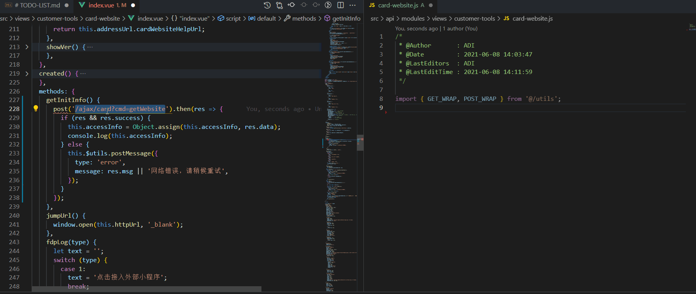
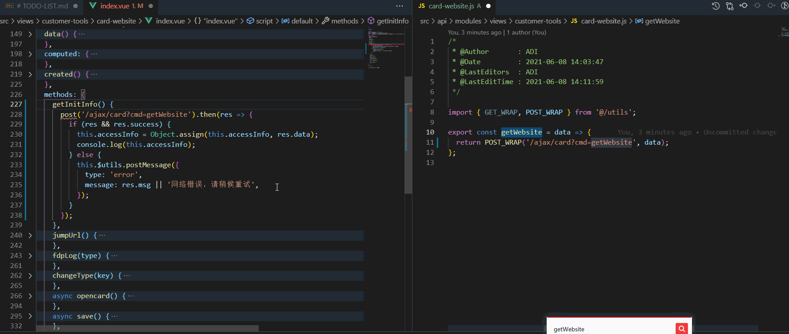
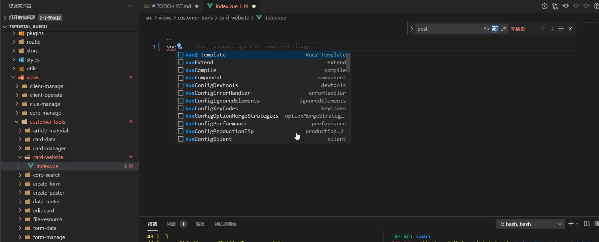

# tsportal-helper


> tsportal-helper is a VS Code extension for Vue.

## Feature

* Autocomplete

## Autocomplete


* Distinguish and auto complete property and method for every components tag.

## Snippets

* `postw | getw`
  


> step: Copy the api, enter `postw`, modify the api variable name, complete.


* `aw`
  


> step: Copy the api variable name, enter `aw`, complete.


* `vue-template`
  


> step: Open or create a new `.vue` file, enter `vue2`, and you are done.


## Configuration

1. Create component label configuration file `touch tags.js`
```javascript
// tags.js
module.exports = {
  "global-demo-button": {
    // Default fill properties
    defaults: ["type"],
    // Label attribute list
    attributes: [
      "type",
      "size",
    ],
    // Annotation
    description: "to trigger an operation",
  },
  // More ...
}
```
2. Create a component property profile `touch attrs.js`
```javascript
// attrs.js
module.exports = {
  "global-demo-button/type": {
    // Optional
    options: [
      "primary",
      "others",
      "default",
      "black",
    ],
    // Defaults
    defaultValue: "primary",
    // Attribute value type
    optionType: "String",
    // Prompt
    description: "to trigger an operation",
  },
  "global-demo-button/size": {
    options: ["medium", "small", "mini"],
    defaultValue: "medium",
    optionType: "String",
    description: "to trigger an operation",
  },
  // More ...
}
```
3. Configure plugin
> vscode => preference => setting up => expand => tsportal-helper


input attrs.js 、 tags.js file path.
```
// examples
windows: C:/PATH/.../tags.js
macOS: /Users/PATH/.../tags.js
```

4. Reopen vscode

5. Complete

## Support

* Vue
* HTML

## Contribution

If you want to help improve this project, Please fork and initiate. a pull request after you fix some bugs or finished some new features. Your pull request will make tsportal-helper better.

## 如何贡献

非常欢迎你的加入！[提一个 Issue](https://github.com/13168335674/vscode-tsportal-vue-helper/issues/new/choose) 或者提交一个 Pull Request

**Pull Request:**

1. Fork 代码!
2. 创建自己的分支: `git checkout -b feat/xxxx`
3. 提交你的修改: `git commit -am 'feat(function): add xxxxx'`
4. 推送您的分支: `git push origin feat/xxxx`
5. 提交`pull request`

## Git 贡献提交规范

- 参考 [vue](https://github.com/vuejs/vue/blob/dev/.github/COMMIT_CONVENTION.md) 规范

  - `feat` 增加新功能
  - `fix` 修复问题/BUG
  - `style` 代码风格相关无影响运行结果的
  - `perf` 优化/性能提升
  - `refactor` 重构
  - `revert` 撤销修改
  - `test` 测试相关
  - `docs` 文档/注释
  - `chore` 依赖更新/脚手架配置修改等
  - `workflow` 工作流改进
  - `ci` 持续集成
  - `types` 类型定义文件更改
  - `wip` 开发中

## LICENSE

MIT

-----------------------------------------------------------------------------------------------------------
## **Enjoy!**