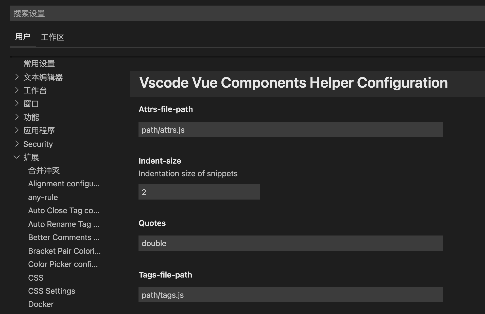

# vscode-vue-components-helper


> vscode-vue-components-helper is a VS Code extension for Vue.

## Feature

* Autocomplete

## Autocomplete


* Distinguish and auto complete property and method for every components tag.

## Configuration

1. Create component label configuration file `touch tags.js`
```javascript
// tags.js
module.exports = {
  "global-demo-button": {
    // Default fill properties
    defaults: ["type"],
    // Label attribute list
    attributes: [
      "type",
      "size",
    ],
    // Annotation
    description: "to trigger an operation",
  },
  // More ...
}
```
2. Create a component property profile `touch attrs.js`
```javascript
// attrs.js
module.exports = {
  "global-demo-button/type": {
    // Optional
    options: [
      "primary",
      "others",
      "default",
      "black",
    ],
    // Defaults
    defaultValue: "primary",
    // Attribute value type
    optionType: "String",
    // Prompt
    description: "to trigger an operation",
  },
  "global-demo-button/size": {
    options: ["medium", "small", "mini"],
    defaultValue: "medium",
    optionType: "String",
    description: "to trigger an operation",
  },
  // More ...
}
```
3. Configure plugin
> vscode => preference => setting up => expand => vscode-vue-components-helper


input attrs.js 、 tags.js file path.
```
// examples
windows: C:/PATH/.../tags.js
macOS: /Users/PATH/.../tags.js
```

4. Reopen vscode

5. Complete

## Support

* Vue

## Contribution

If you want to help improve this project, Please fork and initiate. a pull request after you fix some bugs or finished some new features. Your pull request will make vscode-vue-components-helper better.

## LICENSE

MIT

-----------------------------------------------------------------------------------------------------------
## **Enjoy!**